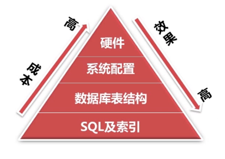
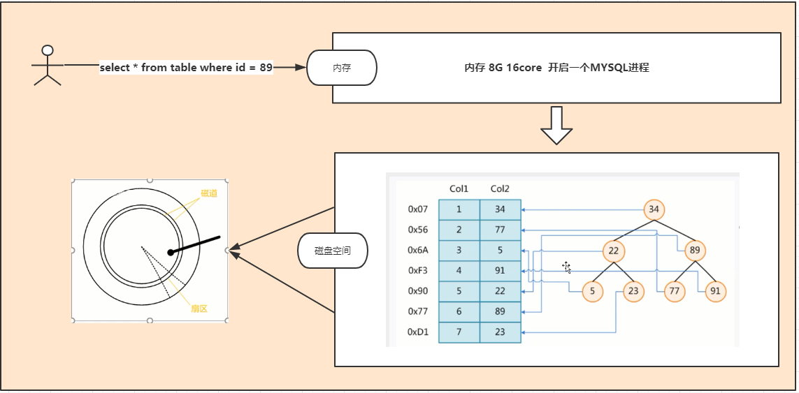
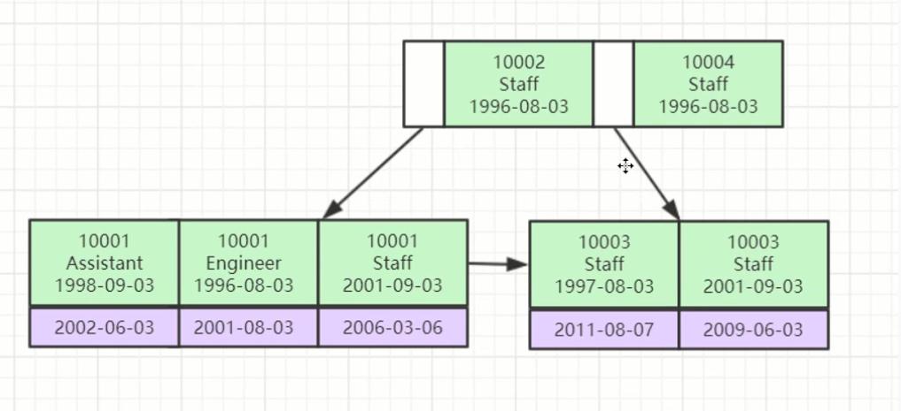
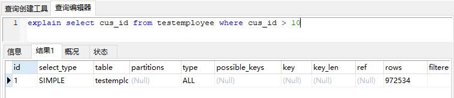
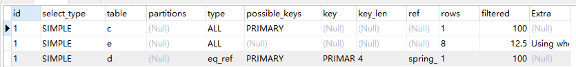
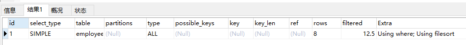
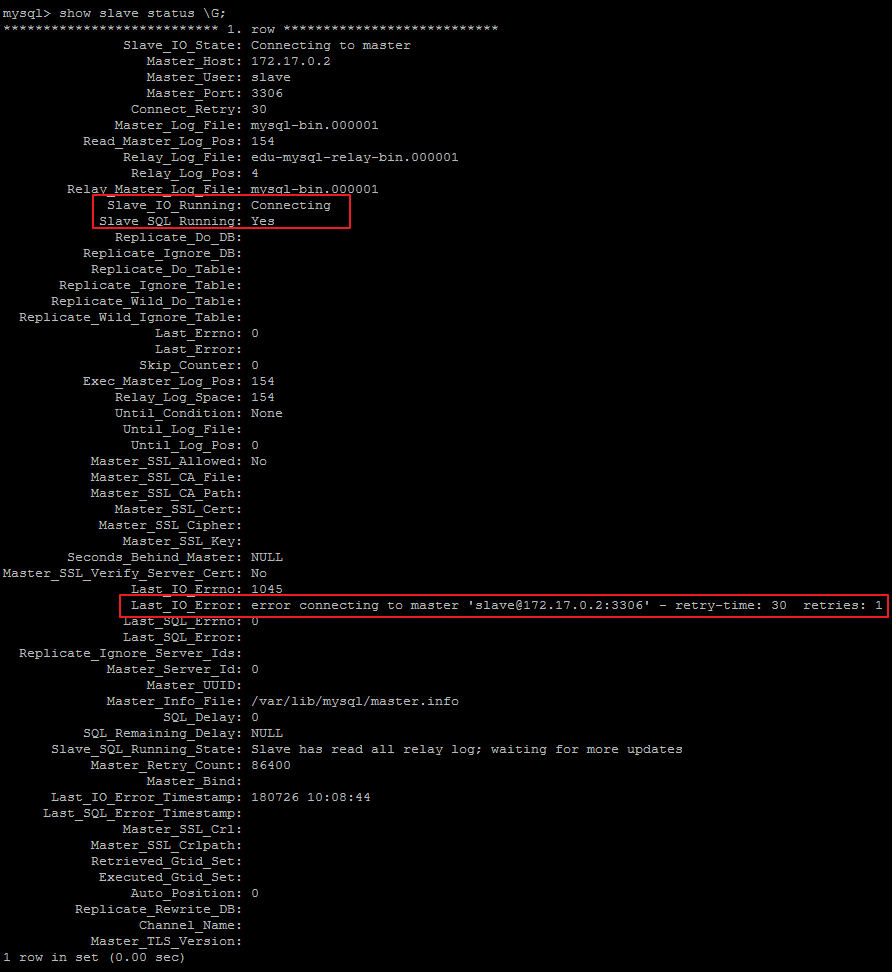

# MYSQL高级

# 01、Docker安装MYSQL

## 01、Docker 安装

```sh
（1）yum 包更新到最新
> yum update

（2）安装需要的软件包， yum-util 提供yum-config-manager功能，另外两个是devicemapper驱动依赖的
> yum install -y yum-utils device-mapper-persistent-data lvm2

（3）设置yum源为阿里云
> yum-config-manager --add-repo http://mirrors.aliyun.com/docker-ce/linux/centos/docker-ce.repo

（4）安装docker
> yum install docker-ce -y

（5）安装后查看docker版本
> docker -v
```

阿里镜像加速

```sh
sudo mkdir -p /etc/docker
sudo tee /etc/docker/daemon.json <<-'EOF'
{
  "registry-mirrors": ["https://0wrdwnn6.mirror.aliyuncs.com"]
}
EOF
sudo systemctl daemon-reload
sudo systemctl restart docker
```


## 02、Docker安装MYSQL

（1）拉取mysql镜像

```properties
docker pull centos/mysql-57-centos7   
docker pull mysql
```


（2）创建容器

```properties
> docker run -di --name=tensquare_mysql -p 3306:3306 -e MYSQL_ROOT_PASSWORD=mkxiaoer  centos/mysql-57-centos7 
# 或者
> docker run -di --name=tensquare_mysql -p 3306:3306 -e MYSQL_ROOT_PASSWORD=mkxiaoer mysql 

启动成功日志
d81df2492094        centos/mysql-57-centos7   "container-entrypoin…"   6 seconds ago Up 5 seconds                  0.0.0.0:33306->3306/tcp   mymysql


 # 查看日志
docker logs -f mymysql
```

p  代表端口映射，格式为  宿主机映射端口:容器运行端口

-e  代表添加环境变量  MYSQL_ROOT_PASSWORD 是root用户的登陆密码

（3）远程登录mysql

连接宿主机的IP ,指定端口为33306


# 02、一个SQL语句的执行过程

首先，需要了解一下MySQL的逻辑架构，当执行一条SQL语句时，我们知道它的执行过程，可以对MySQL有更深入的了解，在出现异常，错误的时候，可以更快速的定位问题所在。
下面是MySQL的简单架构示意图，从图中可以看到一条SQL语句的执行和MySQL之间的关系。


MySQL主要分为Server层和存储引擎层。
（1）Server层包含连接器、查询缓存、分析器、优化器、执行器等，涵盖MySQL大多核心服务功能，以及所有的内置函数（如日期、时间、数学和加密函数等）。所有跨存储引擎的功能都在这一层，如存储转发，视图，触发器等。
（2）存储引擎层负责数据的存储和提取，其架构是插件式的，支持 InnoDB、MyISAM、Memory 等多个存储引擎。现在最常用的存储引擎是 InnoDB，它从 MySQL 5.5.5 版本开始成为了默认存储引擎。（你也可以选择存储引擎，来指定内存引擎创建表）
从图中可以看出，不同存储引擎共用一个Server层，从连接器到执行器。下面介绍一下Server层的各个功能。

### 1）连接器

连接器负责跟客户端建立连接、获取权限、维持和管理连接。代码命令如下：

```sh
mysql -h$ip -P$port -u$user -p
```


输完命令之后，需要在交互对话里面输入密码，不建议直接p后接密码。
连接命令中的 mysql 是客户端工具，用来跟服务端建立连接。在完成经典的 TCP 握手后，连接器就要开始认证你的身份，这个时候用的就是你输入的用户名和密码。

连接完成后，如果你没有后续的动作，这个连接就处于空闲状态。客户端如果太长时间没动静，连接器就会自动将它断开。这个时间是由参数 wait_timeout 控制的，默认值是 8 小时。如果在连接被断开之后，客户端再次发送请求的话，就会收到一个错误提醒： Lost connection to MySQL server during query。这时候如果要继续，就需要重连，然后再执行请求了。

下面讲一下数据库的长连接和短连接：

长连接是指连接成功后，如果客户端持续有请求，则一直使用同一个连接。
短连接则是指每次执行完很少的几次查询就断开连接，下次查询再重新建立一个。
建立连接的过程比较复杂，建议使用长连接，但使用长连接，MySQL的占用内存涨的很快，因为MySQL 在执行过程中临时使用的内存是管理在连接对象里面的，这些资源会在连接断开的时候才释放。所以长连接累计下来，内存占用特别大，可能会被系统强行杀掉（OOM），就是 MySQL 异常重启。
为了解决这个问题，有两种方案：

定期断开长连接。

如果是MySQL 5.7 或更新版本，可以在每次执行一个比较大的操作后，通过执行 mysql_reset_connection 来重新初始化连接资源。这样可以恢复到连接刚刚创建完成的状态。

### 2）查询缓存

建立连接成功后，可以执行select命令，逻辑则执行查询缓存。MySQL拿到一个查询请求，会先查找查询缓存，看是否是之前执行过的语句，如果之前执行过，则会以（key,value）对存储在内存中，key是查询语句，value是查询结果。如果语句不在查询缓存中，则执行后面的过程。
==虽然看起来查询缓存的效率非常高，但建议不要使用查询缓存。因为查询缓存的失效非常频繁，只要有对一个表的更新，这个表上所有的查询缓存都会被清空。==

**MySQL 8.0 版本直接将查询缓存 的整块功能删掉了。**

### 3）分析器（做什么）

分析器先进行词法分析，输入的是由多个字符串和空格组成的一条 SQL 语句，MySQL需要识别出里面的字符串分别是什么，代表什么。MySQL从你输入的"select"这个关键字识别出来，这是一个查询语句。它也要把字符串“T”识别成“表名 T”，把字符串“ID”识别成“列 ID”。
然后是语法分析。根据词法分析的结果，语法分析器会根据语法规则，判断你输入的这个 SQL 语句是否满足 MySQL 语法。

### 4）优化器（怎么做）

经过了分析器，MySQL 就知道你要做什么了。在开始执行之前，还要先经过优化器的处理。
优化器是在表里面有多个索引的时候，决定使用哪个索引；或者在一个语句有多表关联（join）的时候，决定各个表的连接顺序。
优化器就是决定执行的方案，在不同执行方法相同的逻辑结果下，选择一种执行方案。
优化器阶段完成后，这个语句的执行方案就确定下来了，然后进入执行器阶段。

### 5）执行器（开始做）

MySQL 通过分析器知道了你要做什么，通过优化器知道了该怎么做，于是就进入了执行器阶段，开始执行语句。
开始执行的时候，要先判断一下你对这个表 T 有没有执行查询的权限，如果没有，就会返回没有权限的错误。如果有权限，就打开表继续执行。打开表的时候，执行器就会根据表的引擎定义，去使用这个引擎提供的接口。
样例：

```sh
select * from T where ID=10;
```


如果这个例子中的表 T 中，ID 字段没有索引，那么执行器的执行流程是这样的：

调用 InnoDB 引擎接口取这个表的第一行，判断 ID 值是不是 10，如果不是则跳过，如果是则将这行存在结果集中。
调用引擎接口取“下一行”，重复相同的判断逻辑，直到取到这个表的最后一行。
执行器将上述遍历过程中所有满足条件的行组成的记录集作为结果集返回给客户端。
对于有索引的表，则是第一次调用的是“取满足条件的第一行”这个接口，之后循环取“满足条件的下一行”这个接口，这些接口都是引擎中已经定义好的。

在数据库的慢查询日志中可以看到一个 == rows_examined==  的字段，表示这个语句执行过程中扫描了多少行。这个值就是在执行器每次调用引擎获取数据行的时候累加的。但是在有些场景下，执行器调用一次，引擎内部扫描了多行，因此引擎扫描行数跟 rows_examined 并不是完全相同的。

### 6）存储引擎（落盘）

- 存储引擎的任务是将执行器的指令落在数据库文件上
- 不同的存储引擎的原理和执行的方法有很大不同（这个是后续课程要着重去讲解和分析的问题）


### 小结

- SQL语句执行的过程设计到了MYSQL几乎所有的模块
- 一个SQL语句是按照，分析-优化-执行-落盘的步骤执行的
- 在MYSQL8.0之后已经停用了查询缓存的功能
- 不同的存储引擎执行的方式不同


# 03、如何设计数据库表

## **尽量不要让数据库做过多运算**

数据库主要是用来存储的，我们应避免让数据库做运算，比如写定时任务，[存储过程](https://so.csdn.net/so/search?q=存储过程&spm=1001.2101.3001.7020)等。复杂的计算应该在程序代码中实现。我们应该尽量简单的使用数据库。

## **控制数据量**

一年内单表数据量一般含char不超过500W条

## **单表字段数量**

单表的字段应该少而精，那多少合适呢？一般单表字段上限控制在20到50个。

在开发中，我们要注意避免使用大SQL、大事务。

## **避免使用NULL字段**

为什么在数据库表字段设计的时候尽量都加上NOT NULL DEFAULT ''，这里面不得不说用NULL字段的弊端：

- 很难进行查询优化
- NULL列加索引，需要额外空间
- 含NULL复合索引无效  
- count(age)  age=null是不会统计的

举例：

1）`a` char(32) DEFAULT NULL **【不推荐】**

2）`b` int(10) NOT NULL **【不推荐】**

3）`c` int(10) NOT NULL DEFAULT 0 **【推荐】**

```sql
`a` char(32) DEFAULT NULL`b` int(10) NOT NULL
```

比如上面这种。

## **少用TEXT**

TEXT类型处理性能远低于VARCHAR

- 强制生成硬盘临时表
- 浪费更多空间
- VARCHAR(65535)==>64K(注意UTF-8)

尽量不用TEXT/BLOB数据类型

如果业务需要必须用，建议拆分到单独的表

## 尽量控制表字段数量

单表的字段数量也不能太多，根据业务场景进行优化调整，尽量调整表字段数少而精，这样有以下好处：

- IO高效
- 全表遍历
- 表修复快
- 提高并发
- alter table更快

那究竟单表多少字段合适呢？

按照单表1G体积，500W行数据量进行评估：

- 顺序读1G文件需N秒
- 单行不超过200Byte
- 单表不超50个纯INT字段
- 单表不超20个CHAR(10)字段

**==>建议单表字段数上限控制在20~50个**

## 平衡范式与冗余

数据库表结构的设计也讲究平衡，以往我们经常说要严格遵循三大范式，所以先来说说什么是范式：

第一范式：单个字段不可再分。唯一性。 

第二范式：不存在非主属性只依赖部分主键。消除不完全依赖。 

第三范式：消除传递依赖。

用一句话来总结范式和冗余：

**冗余是以存储换取性能，**

**范式是以性能换取存储。**

所以，一般在实际工作中冗余更受欢迎一些。

模型设计时，这两方面的具体的权衡，首先要以企业提供的计算能力和存储资源为基础。

其次，一般互联网行业中都根据Kimball模式实施数据仓库，建模也是以任务驱动的，因此冗余和范式的权衡符合任务需要。

例如，一份指标数据，必须在早上8点之前处理完成，但计算的时间窗口又很小，要尽可能减少指标的计算耗时，这时在计算过程中要尽可能减少多表关联，模型设计时需要做更多的冗余。

## 拒绝3B

数据库的并发就像城市交通，呈非线性增长

这就要求我们在做数据库开发的时候一定要注意高并发下的瓶颈，防止因高并发造成数据库瘫痪。

这里的拒绝3B是指：

- 大SQL（**B**IG SQL）：要减少
- 大事务（**B**IG Transaction）
- 大批量（**B**IG Batch）

## 用好数值字段类型

三类数值类型：

- 整型：TINYINT(1Byte)、TINYINT(1Byte)、SMALLINT(2B)、MEDIUMINT(3B)、INT(4B)、BIGINT(8B)
- 浮点型：FLOAT(4B)、DOUBLE(8B)
- DECIMAL(M,D)

以几个常见的例子来进行说明：

1）INT(1) VS INT(11)

很多人都分不清INT(1)和INT(11)的区别，想必大家也很好奇吧，其实1和11其实只是显示长度的却别而已，也就是不管int（x）x的值是什么值，存储数字的取值范围还是int本身数据类型的取值范围，x只是数据显示的长度而已。

2）BIGINT AUTO_INCREMENT

大家都知道，有符号int最大可以支持到约22亿，远远大于我们的需求和MySQL单表所能支持的性能上限。对于OLTP应用来说，单表的规模一般要保持在千万级别，不会达到22亿上限。如果要加大预留量，可以把主键改为改为无符号int，上限为42亿，这个预留量已经是非常的充足了。

使用bigint，会占用更大的磁盘和内存空间，内存空间毕竟有限，无效的占用会导致更多的数据换入换出，额外增加了IO的压力，对性能是不利的。

**因此推荐自增主键使用int unsigned类型，但不建议使用bigint。**

3）DECIMAL(N,0)

当采用DECIMAL数据类型的时候，一般小数位数不会是0，如果小数位数设置为0，那建议使用INT类型


## 不在数据库里存图片

可见，如果将图片全部存在数据库，将使得数据库体积变大，会造成读写速度变慢。

图片存数据库的弊端：

- 对数据库的读/写的速度永远都赶不上文件系统处理的速度
- 数据库备份变的巨大，越来越耗时间
- 对文件的访问需要穿越你的应用层和数据库层


## 数据表的设计原则其它参考

1、数据表的个数越少越好

RDBMS的核心在于对实体和联系的定义，也就是E-R图（Entity Relationship Diagram），数据表越少，证明实体和联系设计得越简洁，既方便理解又方便操作。

2、数据表中的字段个数越少越好

字段个数越多，数据冗余的可能性越大。设置字段个数少的前提是各个字段相互独立，而不是某个字段的取值可以由其他字段计算出来，当然字段个数少是相对的，我们通常会在数据冗余和检索效率中进行平衡。

3、数据表中联合主键的字段个数越少越好

设置主键是为了确定唯一性，当一个字段无法确定唯一性的时候，就需要采用联合主键的方式（也就是用多个字段来定义一个主键）。联合主键中的字段越多，占用的索引空间越大，不仅会加大理解难度，还会增加运行时间和索引空间，因此联合主键的字段个数越少越好。

4、使用主鍵和外鍵越多越好

数据库的设计实际上就是定义各种表，以及各种字段之间的关系。这些关系越多，证明这些实体之间的冗余度越低，利用度越高，这样做的好处在于不仅保证了数据表之间的独立性，还能提升相互之间的关联使用率。

“三少一多"原则的核心就是简单可复用。简单指的是用更少的表、更少的字段、更少的联合主键字段来完成数据表的设计。可复用则是通过主键、外键的使用来增强数据表之间的复用率。因为一个主键可以理解是一张表的代表。键设计得越多，证明它们之间的利用率越高。

注意：这个原则并不是绝对的，有时候我们需要牺牲数据的冗余度来换取数据处理的效率。

## 数据库对象编写建议

关于库
【强制】库的名称必须控制在32个字符以内，只能使用英文字母、数字和下划线，建议以英文字 母开头。
【强制】库名中英文 一律小写 ，不同单词采用 下划线 分割。须见名知意。
【强制】库的名称格式：业务系统名称_子系统名。 _
【强制】库名禁止使用关键字（如type,order等）。
【强制】创建数据库时必须 显式指定字符集 ，并且字符集只能是utf8或者utf8mb4。 创建数据库SQL举例：CREATE DATABASE crm_fund DEFAULT CHARACTER SET ‘utf8’ ;
【建议】对于程序连接数据库账号，遵循 权限最小原则 使用数据库账号只能在一个DB下使用，不准跨库。程序使用的账号 原则上不准有drop权限 。
【建议】临时库以 tmp_ 为前缀，并以日期为后缀； 备份库以 bak_ 为前缀，并以日期为后缀。
关于表、列
1.【强制】表和列的名称必须控制在32个字符以内，表名只能使用英文字母、数字和下划线，建议 以 英文字母开头 。

2.【强制】表和列的名称必须控制在32个字符以内，表名只能使用英文字母、数字和下划线，建议 以 英文字母开头 。

3.【强制】表名要求有模块名强相关，同一模块的表名尽量使用 统一前缀 。比如：crm_fund_item

4.【强制】创建表时必须 显式指定字符集 为utf8或utf8mb4。

5.【强制】表名、列名禁止使用关键字（如type,order等）。

6.【强制】创建表时必须 显式指定表存储引擎 类型。如无特殊需求，一律为InnoDB。

7.【强制】建表必须有comment。

8.【强制】字段命名应尽可能使用表达实际含义的英文单词或 缩写 。如：公司 ID，不要使用 corporation_id, 而用corp_id 即可。

9.【强制】布尔值类型的字段命名为 is_描述 。如member表上表示是否为enabled的会员的字段命 名为 is_enabled。

10.【强制】禁止在数据库中存储图片、文件等大的二进制数据

通常文件很大，短时间内造成数据量快速增长，数据库进行数据库读取时，通常会进行大量的随 机IO操作，文件很大时，IO操作很耗时。通常存储于文件服务器，数据库只存储文件地址信息。
11.【建议】建表时关于主键： 表必须有主键 (1)强制要求主键为id，类型为int或bigint，且为 auto_increment 建议使用unsigned无符号型。 (2)标识表里每一行主体的字段不要设为主键，建议 设为其他字段如user_id，order_id等，并建立unique key索引。因为如果设为主键且主键值为随机 插入，则会导致innodb内部页分裂和大量随机I/O，性能下降。

12.【建议】核心表（如用户表）必须有行数据的 创建时间字段 （create_time）和 最后更新时间字段 （update_time），便于查问题。

13.【建议】表中所有字段尽量都是 NOT NULL 属性，业务可以根据需要定义 DEFAULT值 。 因为使用 NULL值会存在每一行都会占用额外存储空间、数据迁移容易出错、聚合函数计算结果偏差等问 题。

14.【建议】所有存储相同数据的 列名和列类型必须一致 （一般作为关联列，如果查询时关联列类型 不一致会自动进行数据类型隐式转换，会造成列上的索引失效，导致查询效率降低）。

15.【建议】中间表（或临时表）用于保留中间结果集，名称以 tmp_ 开头。

备份表用于备份或抓取源表快照，名称以 bak_ 开头。中间表和备份表定期清理。
16.【建议】创建表时，可以使用可视化工具。这样可以确保表、字段相关的约定都能设置上。

实际上，我们通常很少自己写 DDL 语句，可以使用一些可视化工具来创建和操作数据库和数据表。 可视化工具除了方便，还能直接帮我们将数据库的结构定义转化成 SQL 语言，方便数据库和数据表结构 的导出和导入。

## 关于索引

【强制】InnoDB表必须主键为id int/bigint auto_increment，且主键值 禁止被更新 。
【强制】InnoDB和MyISAM存储引擎表，索引类型必须为 BTREE 。
【建议】主键的名称以 pk_ 开头，唯一键以 uni_ 或 uk_ 开头，普通索引以 idx_ 开头，一律 使用小写格式，以字段的名称或缩写作为后缀。
【建议】多单词组成的columnname，取前几个单词首字母，加末单词组成column_name。如: sample 表 member_id 上的索引：idx_sample_mid。
【建议】单个表上的索引个数 不能超过6个 。
【建议】在建立索引时，多考虑建立 联合索引 ，并把区分度最高的字段放在最前面。
【建议】在多表 JOIN 的SQL里，保证被驱动表的连接列上有索引，这样JOIN 执行效率最高。
【建议】建表或加索引时，保证表里互相不存在 冗余索引 。 比如：如果表里已经存在key(a,b)， 则key(a)为冗余索引，需要删除。

## SQL编写

【强制】程序端SELECT语句必须指定具体字段名称，禁止写成 *。
【建议】程序端insert语句指定具体字段名称，不要写成INSERT INTO t1 VALUES(…)。
【建议】除静态表或小表（100行以内），DML语句必须有WHERE条件，且使用索引查找。
【建议】INSERT INTO…VALUES(XX),(XX),(XX)… 这里XX的值不要超过5000个。 值过多虽然上线很 快，但会引起主从同步延迟。
【建议】SELECT语句不要使用UNION，推荐使用UNION ALL，并且UNION子句个数限制在5个以 内。
【建议】线上环境，多表 JOIN 不要超过5个表。
【建议】减少使用ORDER BY，和业务沟通能不排序就不排序，或将排序放到程序端去做。ORDER BY、GROUP BY、DISTINCT 这些语句较为耗费CPU，数据库的CPU资源是极其宝贵的。
【建议】包含了ORDER BY、GROUP BY、DISTINCT 这些查询的语句，WHERE 条件过滤出来的结果 集请保持在1000行以内，否则SQL会很慢。
【建议】对单表的多次alter操作必须合并为一次 对于超过100W行的大表进行alter table，必须经过DBA审核，并在业务低峰期执行，多个alter需整 合在一起。 因为alter table会产生 表锁 ，期间阻塞对于该表的所有写入，对于业务可能会产生极 大影响。
【建议】批量操作数据时，需要控制事务处理间隔时间，进行必要的sleep。
【建议】事务里包含SQL不超过5个。 因为过长的事务会导致锁数据较久，MySQL内部缓存、连接消耗过多等问题。

【建议】事务里更新语句尽量基于主键或UNIQUE KEY，如UPDATE… WHERE id=XX;否则会产生间隙锁，内部扩大锁定范围，导致系统性能下降，产生死锁。


## **mysql一张表最多多少字段**


MySQL是一种广泛使用的开源关系型数据库管理系统，可以用于存储和管理大量的数据。在MySQL中，我们可以创建多个表来组织数据，每个表可以包含多个字段来描述和定义数据的结构。但是，每张表能够拥有的字段数量是有限制的。

### 字段数量限制

在MySQL中，每张表的字段数量是有限制的。具体的限制取决于所使用的MySQL版本和表的存储引擎。对于InnoDB存储引擎，MySQL 5.7及之前的版本中，每张表的字段数量最多为4096个。而对于MySQL 8.0及更高版本，这一限制被扩大到了16384个。如果使用的是MyISAM存储引擎，每张表的字段数量最多为65535个。

除了字段数量的限制外，还需要考虑其他方面的因素，例如表的行大小和表的总数据大小。在实际应用中，通常不会出现需要使用如此巨大数量的字段的情况。如果表的字段数量超过几十个，通常可以考虑进行表结构的优化，将一些重复或冗余的字段合并，以减少字段数量。

### 总结

MySQL中每张表的字段数量是有限制的，具体限制取决于MySQL版本和使用的存储引擎。对于InnoDB存储引擎，MySQL 5.7及之前的版本中，每张表的字段数量最多为4096个，而MySQL 8.0及更高版本中，这一限制被扩大到了16384个。如果使用的是MyISAM存储引擎，每张表的字段数量最多为65535个。在实际应用中，一般不会出现需要使用如此巨大数量的字段的情况。通常可以通过对表结构进行优化，合并重复或冗余的字段，以减少字段数量。

除了字段数量的限制外，还要考虑其他方面的因素，例如表的行大小和表的总数据大小。在设计数据库表结构时，应根据实际需求合理安排字段，并进行适当的优化，以提高数据库的性能和可维护性。


# MySQL高级性能优化

在应用开发的过程中，由于前期数据量少，开发人员编写的SQL语句或者数据库整体解决方案都更重视在功能上的实 现，但是当应用系统正式上线后，随着生成数据量的急剧增长，很多SQL语句和数据库整体方案开始逐渐显露出了性 能问题，对生成的影响也越来越大，此时Mysql数据库的性能问题成为系统应用的瓶颈，因此需要进行Mysql数据库   的性能优化。

- **1.1 性能下降的表现**

```properties
执行时间长
等待时间长
```

- **1.2 性能下降的原因**

```properties
查询语句写的不好，各种连接，各种子查询导致用不上索引或者没有建立索引
建立的索引失效，建立了索引,在真正执行时,没有用上建立的索引
关联查询太多join
服务器调优及配置参数导致，如果设置的不合理,比例不恰当,也会导致性能下降,sql变慢 
系统架构的问题
```

- **1.3 通用的优化方案**



**生产数据库的mysql的并发数**


优化分为：

- 设计优化: 表的设计合理化(符合3NF，有时候要进行反三范式操作) 
- 索引优化: 添加适当索引(index）(重点)
- Sql优化: 写出高质量的sql，避免索引失效 (重点)
- 架构优化: 分表技术(水平分割、垂直分割) 主从复制，读写分离
- ==配置优化: 对mysql配置优化 [配置最大并发数my.ini, 调整缓存大小 ]==
- ==硬件优化: 服务器的硬件优化==


# 04、MYSQL数据库优化 - 索引优化

## 01、MySQL索引原理及概念


**分析**

索引是解决SQL性能问题的重要手段之一，使用索引可以帮助用户解决大多数的SQL性能问题。索引==就是数据结构==，  索引是Mysql高效获取数据的数据结构,,==类似新华字典的索引目录,==可以通过索引目录快速查到你想要的字.排好序的快   速查找数据

索引对数据库得性能得影响还是非常的关键 ，索引主要作用：告知存储引擎如何快速的找到我们所需的数据。

==当表中得数据还比较小得时候，索引还不足以发挥它得意义和价值==。因为这个时候表中的数据会村部缓存到内存中。就算是全表扫描也不会太慢。而随着表中的数据越来越多。查询也越来越频繁，内存也不能完全的缓存表中的数据，这个时候索引就会显得越来越重要。

在实际的开发中，往往很多时候会忽略或者过度的强调索引。形成了两个极端，要么就是除了主键以外的都不建设索引，要么就是泛滥建设索引。这些都是不好的优化体验，索引太少数据量越大的时候，性能可能得不到提升，太多维护索引的时间就会很长，消耗的内存和cpu也会越多。也不利于查询的性能提升。

**磁盘存取示意图**

每次从磁盘中查找数据称为磁盘I/O， 而磁盘IO 至少要经历磁盘寻道、磁盘旋转、数据读取等等操作，非常消耗性能，所以对于读取数据，最大的优化就是减少磁盘I/O


&nbsp;


**执行sql的过程**

- 会发起一起磁盘IO = 寻道 + 旋转 + 读取数据 + 返回数据存储内存的过程。
- 如果条件不满足就会不停的寻道和发起IO。
- 怎么解决这个问题，来解决这个问题呢？没错就是优化表，对表的数据进行重新编排和建立目录映射。其实就是优化数据的存储的结构，就是建立索引。




## 02、MySQL索引的底层实现

**底层数据结构分析**


### **二叉树**


为了加快数据的查找,可以维护**二叉查找树**,  每个节点分别包含索引键值和一个指向对应数据记录的物理地址的指针,这样就可以运用二叉查找在一定的复杂度内获取相应的数据,从而快速的检索出符合条件 的记录

```
左子树的键值小于根的键值
右子树的键值大于根的键值
```

从二叉树的查找过程了来看，最坏的情况下磁盘IO的次数由树的高度来决定。从前面分析情况来看，减少磁盘IO的次数就必须要压缩树的高度，让瘦高的树尽量变成矮胖的树，所以引出B-Tree强势登场

参考网站： https://www.cs.usfca.edu/~galles/visualization/BST.html 

**缺点**

- 二叉树是一种偏向树，会造成层级过深，给查询其实并没用提高性能。
- 二叉树也只能存两个节点，层级越来越大越来越深，发生磁盘的IO会越频繁。


### **B-Tree** 

 ==B树是一种多路自平衡搜索树==，它类似普通的二叉树，但是B书允许每个节点有更多的子节点。B树示意图如下： 

  

```
为了提升度的长度，还需要对这种数据结构进行优化，所以它的升华版B+Tree诞生了
```

**特点**

- 和二叉树一样比父节点大的数据存储在右边，小的存储在左边。

- 平衡查询树，它对数据会进行自我平衡。它比二叉树的层级要低。所以查询的性能要比二叉树高很多。
- 度（degree)节点的数据存储个数。度越深代表存储的数据越密，树的层级和高度就越低。越利于搜索和存储数据。评价一个索引的好坏一定是进入索引的次数越小越快。
- 节点具有相同的深度
- 节点中数据key从左到有递增排列
- 叶节点的指针为空.


参考： https://www.cs.usfca.edu/~galles/visualization/BTree.html 

**缺点**

- Btree数据是存储到每个节点自己，所以每次查询的和维护的时候就会维护索引值又维护了数据，这样会就是造成内存的浪费和性能的消耗。这也是B+TREE优化的地方。


### **B+Tree**

- 也就是我们通常数据库所说的索引。
- b-tree索引底层：**==采用b+tree的方式进行结构存储数据==** 

在说B+树之前我们先了解一下为什么要有B树，其实这些树最开始都是为了解决某种系统中，查询效率低的问题。B树其实最开始源于的是二叉树，二叉树是只有左右孩子的树，当数据量越大的时候，二叉树的节点越多，那么当从根节点搜索的时候，影响查询效率。所以如果这些节点存储在外存储器中的话，每访问一个节点，相当于进行了一次I/O操作。

#### 外存储器和内存储器：

**外存储器：**就是将数据存储到磁盘中，每次查找的某个元素的时候都要取磁盘中查找，然后再写入内存中，容量大，但是查询效率低。

**内存储器：**就是将数据放在内存中，查询快，但是容量小。

我们大致了解了B树和什么是外存储器，内存储器，那么就知道其实B+树就是为了解决数据量大的时候存储在外存储器时候，查找效率低的问题。接下来就说下B+树的特点：

- 中间元素不存数据，只是当索引用，所有数据都保存在叶子结点中。
- 所有的中间节点在子节点中要么是最大的元素要么是最小的元素 。
- 叶子结点包含所有的数据，和指向这些元素的指针，而且叶子结点的元素形成了自小向大这样子的链表。

 B+树是B树的变体，也是一种多路平衡查找树，B+树的示意图为： 

**特点**

```properties
非叶子节点不存储data,只存储key,可以增大度
叶子节点不存储指针
顺序访问指针，提高区间访问能力
```

 

 

B+Tree**索引的性能分析**

```
一般使用磁盘I/O次数评价索引结构的优劣
预读：磁盘一般会顺序向后读取一定长度的数据(页的整数倍)放入内存
局部性原理：当一个数据被用到时，其附近的数据也通常会马上被使用
B+Tree的度一般会超过100，因此h非常小 (一般为3到5之间)，性能就会非常稳定
B+Tree叶子节点有顺序指针，更容易做范围查询
存储器读取数据按 磁盘块读取 
每个磁盘块的大小为  扇区（页）的2的N次方
每个扇区的最小单位 512B 或 4096B 不同的生产厂家不同
```

参考网站： https://www.cs.usfca.edu/~galles/visualization/BPlusTree.html 

如下这个图就很好的说明了B+的特点


看图其实可以看到一个节点可以存放多个数据，查找一个节点的时候可以有多个元素，大大提升查找效率，这就是为什么数据库索引用的就是B+树，因为索引很大，不可能都放在内存中，所以通常是以索引文件的形式放在磁盘上，所以当查找数据的时候就会有磁盘I/O的消耗，而B+树正可以解决这种问题，减少与磁盘的交互，因为进行一次I/O操作可以得到很多数据，增大查找数据的命中率。

这就可以很明显的看出B+树的优势：

1. 单个节点可以存储更多的数据，减少I/O的次数。
2. 查找性能更稳定，因为都是要查找到叶子结点。
3. 叶子结点形成了有序链表，便于查询。

B+树是怎么进行查找的呢，分为单元素查找和范围查找

单元素查找是从根一直查找到叶子结点，即使中间结点有这个元素也要查到叶子结点，因为中间结点只是索引，不存数据。比如要查元素3，如图：


 范围查找是直接从链表查，比如要查元素3到元素8的，如图：


#### Btree索引的遵循原则和使用限制

- 遵循最左原则开始查找，否则无法命中索引

  ```sql
  name+age+email建设了一个联合索引
  select * from tab where age = 12 and email ='xxx@qq.com'//命中不到索引
  ```

- 使用索引时，不能跳过索引中的列

  ```sql
  name+age+email建设了一个联合索引
  select * from tab where name = 12 and email ='xxx@qq.com'//只会命中name的索引不会命中email的索引了
  ```

- not int和<>操作无法使用索引

  ```sql
  name+age+email建设了一个联合索引
  select * from tab where name <> 12 and email ='xxx@qq.com'//索引失效
  ```

- 如果查询中有某个列的范围查询，则其右边所有列都无法使用索引。

  ```sql
  name+age+email建设了一个联合索引
  select * from tab where name = 'zhangsan' and age > 10 and email ='xxx@qq.com'//name+age命中，email失效
  ```


### **Hash** 


```
使用hash结构存储索引，查找单行数据很快，但缺点也很明显。 
1：无法用于排序 
2：只支持等值查找 
3.存在Hash冲突  Hash索引只适用于某些特定场景，我们使用不多
```


## 03、MySQL的索引实现

**MyISAM索引(非聚簇)**

MyISAM 索引文件和数据文件是分离的


**InnoDB索引(聚簇)**

>数据文件本身就是索引文件
>表数据文件本身就是按照B+Tree组织的一个索引结构文件
>聚集索引-叶节点包含了完整的数据记录


**联合索引**




## 04、MySQL索引的优劣势

**优势**

```
1.可以通过建立唯一索引或者主键索引,保证数据库表中每一行数据的唯一性.
2.建立索引可以大大提高检索的数据,以及减少表的检索行数
3.在表连接的连接条件 可以加速表与表直接的相连
4.在分组和排序字句进行数据检索,可以减少查询时间中 分组 和 排序时所消耗的时间(数据库的记录会重新排序)
5.建立索引,在查询中使用索引 可以提高性能
```

**劣势**

```
1.在创建索引和维护索引 会耗费时间,随着数据量的增加而增加
2.索引文件会占用物理空间,除了数据表需要占用物理空间之外,每一个索引还会占用一定的物理空间
3.当对表的数据进行INSERT,UPDATE,DELETE 的时候,索引也要动态的维护,这样就会降低数据的维护速度,(建立索引会占用磁盘空间的索引文件。一般情况这个问题不太严重，但如果你在一个大表上创建了多种组合索引，索引文件的会膨胀很快)。
```

**索引的分类**

```
1.普通索引index :加速查找
2.唯一索引
	主键索引：primary key ：加速查找+约束（不为空且唯一）
	唯一索引：unique：加速查找+约束 （唯一）
3.联合索引（组合索引）
	-primary key(id,name):联合主键索引
	-unique(id,name):联合唯一索引
	-index(id,name):联合普通索引
4.全文索引fulltext :用于搜索很长一篇文章的时候，效果最好。 ---Elasticsearch
```


## 05、MySQL索引的操作

**创建索引**

```
create [UNIQUE|primary|fulltext] index 索引名称 ON 表名(字段(长度))
```

```mysql
CREATE INDEX emp_name_index ON employee(NAME);
```

**测试脚本**

```
资料中  testemployee.sql文件
```

**没有使用索引查询的时间如下**：

```mysql
select cus_id from testemployee where cus_id=5   # 时间: 0.311ms
```

**创建索引后查询的时间如下**：

```mysql
-- 为num创建一个索引
create index idx_cusid on testemployee(cusid)
-- 再次查询耗时
select cus_id from testemployee where cus_id=5 # 时间: 0.041ms
```

**查看索引**

```
show index from 表名
```

**删除索引**

```
drop index[索引名称] on 表名
DROP INDEX emp_name_index ON employee;
```

**更改索引**

```mysql
alter table tab_name add primary key(column_list)
-- 添加一个主键,索引必须是唯一索引,不能为NULL
alter table tab_name add unque index_name(column_list)
-- 创建的索引是唯一索引,可以为NULL
alter table tab_name add index index_name(column_list)
-- 普通索引,索引值可出现多次
alter table tab_name add fulltext index_name(column_list)
```


# 05、MYSQL数据库优化 - 索引优化策略


## 01、MySQL索引列什么样子的列适合选择成为索引

**适合建立索引**

```
1.主键自动建立唯一索引:primary 
2.频繁作为查询条件的字段应该创建索引
比如银行系统银行帐号,电信系统的手机号
3.查询中与其它表关联的字段,外键关系建立索引
比如员工表的部门外键
4.频繁更新的字段不适合建立索引
每次更新不单单更新数据,还要更新索引
5.where条件里用不到的字段不建立索引
6.查询中排序的字段,排序的字段若通过索引去访问将大大提升排序速度
索引能够提高检索的速度和排序的速度
7. 查询中统计或分组的字段
```

**不适合建立索引**

```
1：记录比较少
2：经常增删改的表
3：索引提高了查询的速度，同时却会降低更新表的速度,因为建立索引后, 如果对表进行INSERT,UPDATE DELETE, MYSQL不仅要保存数据,还要保存一下索引文件
4：数据重复的表字段
5：如果某个数据列包含了许多重复的内容,为它建立索引  就没有太大在的实际效果，比如表中的某一个字段为国籍,性别，数据的差异率不高,这种建立索引就没有太多意义。
```


## 02、常见的MySQL性能分析工具和配置

### **慢查询日志**

```
mysql的慢查询日志是mysql提供的一种日志记录，它用来记录在mysql中响应时间超过阀值的语句,mysql 的日志是跟踪mysql性能瓶颈的最快和最直接的方式了，系统性能出现瓶颈的时候，首先要打开慢查询日志，进行跟踪，尽快的分析和排查出执行效率较慢的SQL ,及时解决避免造成不好的影响。

**作用**： 记录具体执行效率较低的SQL语句的日志信息。

注意：
在默认情况下mysql的慢查询日志记录是关闭的。
同时慢查询日志默认不记录管理语句和不使用索引进行查询的语句
```

**查看是否开启慢查询日志**

```mysql
show variables like '%slow_query_log%'

开启
set global slow_query_log=1;
只对当前数据库生效,如果重启后，则会失效

如果想永久生效，必须修改配置文件
slow_query_log=1
slow_query_log_file=地址
```

**设置慢查询的阀值**

默认情况下是：10s

```mysql
show variables like 'long_query_time'
set global long_query_time=4;
```

**要断开连接后, 才能生效**

```mysql
show global variables like 'long_query_time';
select sleep(4)
show global status like '%slow_queries%';
```

**慢查询日志分析**

```
慢查询日志中可能会出现很多的日志记录，我们可以通过慢查询日志工具进行分析，MySQL默认安装了
mysqldumpslow工具实现对慢查询日志信息的分析。
```

```
-- 得到返回记录集最多的10个SQL。
mysqldumpslow.pl -s r -t 10 /var/lib/mysql/data/61d50d6107ef-slow.log
-- 得到访问次数最多的10个SQL
mysqldumpslow.pl -s c -t 10 /var/lib/mysql/data/61d50d6107ef-slow.log
-- 得到按照时间排序的前10条里面含有左连接的查询语句。
mysqldumpslow.pl -s t -t 10 -g “left join” C:\soft\DESKTOP-8GVEK4U-slow.log
-- 另外建议在使用这些命令时结合 | 和more 使用 ，否则有可能出现刷屏的情况。
mysqldumpslow.pl -s r -t 20 C:\soft\DESKTOP-8GVEK4U-slow.log

Count: 4（执行了多少次）  
Time=375.01s（每次执行的时间） 
(1500s)（一共执行了多少时间）  
Lock=0.00s(0s)（等待锁的时间）  
Rows=10200.3（每次返回的记录数） (40801)（总共返回的记录
数）, 
username[password]@[10.194.172.41]
```

**参数说明**

```
参数
-s 按照那种方式排序
c：访问计数
l：锁定时间
r:返回记录

al：平均锁定时间
ar：平均访问记录数
at：平均查询时间

-t 是top 

n的意思，返回多少条数据。

-g 可以跟上正则匹配模式，大小写不敏感。
```

**第三方的慢查询日志分析工具：mysqlsla，myprofi，pt-query-diges等等**


### 执行计划Explain

**概念及作用**

```
使用explain关键字,可以模拟优化器执行的SQL语句
从而知道MYSQL是如何处理sql语句的
通过Explain可以分析查询语句或表结构的性能瓶颈


具体作用：
	查看表的读取顺序
	数据读取操作的操作类型
	查看哪些索引可以使用
	查看哪些索引被实际使用
	查看表之间的引用
	查看每张表有多少行被优化器执行
```

**使用方法**

```mysql
使用Explain关键字 放到sql语句前

explain select cus_id from testemployee where cus_id > 10
```




**参数详解**


**id**​	 （重要）

```
 select查询的序列号，包含一组数字,表示查询中执行select子句或操作表的顺序	
 值分为三种情况

**id值相同**
	执行顺序由上到下

**id不同**
	如果是子查询,id的序号会递增,id值越大优先级越高,优先被执行

**id相同不同,同时存在**
	可以认为是一组,从上往下顺序执行
	在所有组中,id值越大,优先级越高,越先执行	
```

```mysql
-- id值相同
EXPLAIN SELECT * from employee e,department d,customer c where e.dep_id = d.id and e.cus_id = c.id;

```



```mysql
-- id值不同	
EXPLAIN SELECT * from department WHERE id = (SELECT id from employee WHERE id=(SELECT id from customer WHERE id = 1))
```


```mysql
-- id值相同 不同都存在 deriverd 衍生出来的虚表
EXPLAIN select * from department d, (select * from employee group by dep_id) t where d.id = t.dep_id;
```


**select_type** 		

	查询类型,主要用于区别普通查询,联合查询,子查询等复杂查询
	结果值
	SIMPLE
		简单select查询,查询中不包含子查询或者UNION
	PRIMARY
		查询中若包含任何复杂的子查询,最外层查询则被标记为primary
	SUBQUERY
		在select或where中包含了子查询
	DERIVED
		在from列表中包含的子查询被标记为derived(衍生)把结果放在临时表当中		
	
	UNION
		若第二个select出现的union之后,则被标记为union
		若union包含在from子句的子查询中,外层select将被标记为deriver
	UNION RESULT
		从union表获取结果select,两个UNION合并的结果集在最后


```mysql
-- union 和 union result 示例
EXPLAIN select * from employee e LEFT JOIN department d on e.dep_id = d.id
UNION 
select * from employee e RIGHT JOIN department D ON e.dep_id = d.id
```


**table**

```
显示这一行的数据是关于哪张表的
```

**partitions **

```\
如果查询是基于分区表的话, 会显示查询访问的分区
```

**type**     (重要)

```
访问类型排列	
结果值:(最好到最差) system > const > eq_ref >  ref > range > index > ALL
```

```mysql
-- system 表中有一行记录(系统表)  这是const类型的特例,平时不会出现
explain select HOST from mysql.db where HOST='localhost'
```


```mysql
-- const  表示通过索引一次就找到了，const用于比较primary 或者 unique索引.   直接查询主键或者唯一索引，因为只匹配一行数据,所以很快
EXPLAIN select id from testemployee where id=1000
```


```mysql
-- eq_ref 唯一性索引扫描 对于每个索引键,表中只有一条记录与之匹配, 常见于主键或唯一索引扫描
EXPLAIN select * from employee e,department d where e.id=d.id
```


```mysql
-- ref 非唯一性索引扫描,返回匹配某个单独值的所有行,本质上也是一种索引访问,它返回所有匹配某个单独值的行可能会找到多个符合条件的行,所以它应该属于查找和扫描的混合体
EXPLAIN select e.id,e.dep_id,d.id from employee e,department d where e.dep_id = d.id
```


```mysql
-- range 只检索给定范围的行,使用一个索引来选择行 一般就是在你的where语句中出现between\<\>\ in等查询,这种范围扫描索引比全表扫描要好,因为它只需要开始于索引的某一点.而结束语另一点,不用扫描全部索引
explain select * from employee where id>2
```


```mysql
-- index index与All区别为index类型只遍历索引树,通常比All要快,因为索引文件通常比数据文件要小all和index都是读全表,但index是从索引中读取,all是从硬盘当中读取
explain select id from employee
```


```mysql
-- ALL 将全表进行扫描,从硬盘当中读取数据,如果出现了All 切数据量非常大, 一定要去做优化
explain select * from employee
```


```
要求:
	一般来说,保证查询至少达到range级别
	最好能达到ref
```

**possible_keys**

```
显示可能应用在这张表中的索引,一个或者多个
查询涉及到的字段上若存在索引,则该索引将被列出,但不一定被查询实际使用
可能自己创建了4个索引,在执行的时候,可能根据内部的自动判断,只使用了3个
```

```mysql
--  可能不会用到索引，实际用到索引
explain select dep_id from employee
```


```mysql
-- 可能会使用索引，实际没用到索引
EXPLAIN select * from employee e,department d where e.dep_id = d.id
```


**key** （重要）

```
实际使用的索引,如果为NULL,则没有使用索引,查询中若使用了覆盖索引 ,则该索引仅出现在key列表

possible_keys与key关系,理论应该用到哪些索引  实际用到了哪些索引
覆盖索引 查询的字段和建立的字段刚好吻合,这种我们称为覆盖索引
```

**key_len**

```mysql
-- 表示索引中使用的字节数,可通过该列计算查询中使用的索引长度 .
explain select * from employee where dep_id=1 and name='鲁班' and age=10
```


**ref**

```
索引是否被引入到, 到底引用到了哪几个索引
```

```mysql
Explain select * from employee e,department d where e.dep_id = d.id and e.cus_id = 1
```


```mysql
Explain select e.dep_id from employee e,department d,customer c where e.dep_id = d.id and e.cus_id = c.id and e.name='鲁班'
```


**rows**

```
根据表统计信息及索引选用情况,大致估算出找到所需的记录所需要读取的行数,每张表有多少行被优化器查询过
```

**filtered**

```mysql
-- 满足查询的记录数量的比例，注意是百分比，不是具体记录数 . 值越大越好，filtered列的值依赖统计信息，并不十分准确
Explain select e.dep_id from employee e,department d where e.dep_id = d.id
```

**Extra**  （重要）

```
注意：语句中出现了Using Filesort 和 Using Temporary说明没有使用到索引
```

**产生的值:**

```mysql
	/* 
	Using filesort (需要优化)
		说明mysql会对数据使用一个外部的索引排序,
		而不是按照表内的索引顺序进行
		Mysql中无法利用索引完成排序操作称为"文件排序"
	*/	
	explain select * from employee where dep_id =1 ORDER BY cus_id
```



```mysql
	/* 
	Using temporary (需要优化)
		使用了临时表保存中间结果,Mysql在对查询结果排序时, 使用了临时表,
		常见于排序orderby 和分组查询group by
	*/
	explain select name from employee where dep_id in (1,2,3) GROUP BY cus_id
```


```mysql
	/*
	impossible where (需要优化)
		where 子句的值总是false 不能用来获取任何元组
	*/	
	explain select name from employee where name='鲁班' and name='zs'
```


		use index
			表示相应的select中使用了覆盖索引,避免访问了表的数据行, 效率很好
			如果同时出现using where  表明索引被用来执行索引键值的查找
			如果没有同时出现using where 表明索引 用来读取数据而非执行查找动作
			示例
		using where
			表明使用了where过滤
		using join buffer
			使用了连接缓存


### MySQL前缀索引和索引列的选择性

索引很长的字符列(很长的varchar、text、blob)，必须使用前缀索引(MyISAM 727字节，Innodb 1000字节)，因为MySQL不允许索引这些、列的完整长度，使用前面所说的伪哈希索引是不行的，通常是索引开始的部分字符，可以节省索引空间，提高索引效率，但是会降低索引的选择性所以需要在前缀索引的大小和选择性之间找到平衡

```sql
create index index_name on table(col_name(n))
```

在开发中如何选择一个列作为索引列，一般就看这列的重复行，重复性越低越适合做索引列。也就是：**==不重复的索引值和表的记录数的比值==** 。如果这个表中记录的唯一性越高说明越适合做索引。比如：主键和唯一列，都特别适合做索引。==**比值越高索引的效率越好，因为选择性高的索引可以在查找时过滤掉更多的行，唯一索引的值是1，这是性能最好的**==


### 联合索引：很多列都建立索引不如建立联合索引

在多个单独列建立独立索引大多数情况不能提高MySQL查询性能，因为需要更多地内存和磁盘IO

- 1、当服务器对多个索引做相交操作(多个and)的时候，通常需要一个包含多个列的多列索引，而不是多个独立的单独索引
- 2、多个or(联合操作)，会消耗大量CPU和内存资源在算法的缓存、排序和合并操作上，这种情况下，还可能有查询的并发性，还不如没有索引，使用union
- 3、如果在explain中看到索引合并，就要检查一下查询和表结构。可以通过optimizer_switch来关闭索引合并功能，也可以使用ignore index

**来让优化器忽略掉某些索引。如何选择索引列的顺序：在不考虑排序和分组的情况下**

- 1、经常使用的列放在最左边，因为索引列是按照 从左到右去使用的
- 2、选择性高的列优先
- 3、宽度小，意味着每一页的数据更多，磁盘IO消耗更少


### 覆盖索引

如果一个索引包含、覆盖所需要==查询的列的值==，就称为"覆盖索引"

**优点：**

- 可以优化缓存，减少磁盘IO操作
- 因为B-tree索引可以减少随机IO，变随机IO访问为顺序IO操作，有利于数据的查询速度
- 避免InnoDB索引的二次查询，这点和Hash索引不同
- 避免MyISAM表进行系统调用，因为MySQL只是缓存索引的信息，数据要依赖操作系统缓存，所以访问数据的时候，需要进行一次系统调用，而系统调用的性能通常不好

**覆盖索引的限制：**

- 存在存储引擎不支持覆盖索引，Memory、hash、全文、空间索引都不能做覆盖索引，只能使用B-Tree索引做覆盖索引
- 查询中使用太多的列，只有索引的大小远远小于数据本身才能发挥索引的作用
- 使用了like '%%'这种双百分号的查询，因为存储引擎底层的API限制的，只能提取数据行的值并加载内存中，然后在内存中进行where过滤

例如：

```sql
CREATE TABLE `house_detail` (
  `id` bigint(11) NOT NULL AUTO_INCREMENT,
  `description` varchar(255) DEFAULT NULL COMMENT '详细描述',
  `layout_desc` varchar(255) DEFAULT NULL COMMENT '户型介绍',
  `traffic` varchar(255) DEFAULT NULL COMMENT '交通出行',
  `round_service` varchar(255) DEFAULT NULL COMMENT '周边配套',
  `rent_way` int(2) NOT NULL COMMENT '租赁方式',
  `address` varchar(32) NOT NULL COMMENT '详细地址 ',
  `subway_line_id` bigint(11) DEFAULT NULL,
  `subway_line_name` varchar(32) DEFAULT NULL COMMENT '附近地铁线名称',
  `subway_station_id` bigint(11) DEFAULT NULL,
  `subway_station_name` varchar(32) DEFAULT NULL COMMENT '地铁站名',
  `house_id` bigint(11) DEFAULT NULL,
  PRIMARY KEY (`id`),
  UNIQUE KEY `index_on_house_id` (`house_id`) USING BTREE
) ENGINE=InnoDB AUTO_INCREMENT=39 DEFAULT CHARSET=utf8mb4 COLLATE=utf8mb4_0900_ai_ci　
```

- 查询如下：EXPLAIN SELECT house_id FROM house_detail WHERE house_id = 15;


可以在Extra中看到Using index，还有使用的索引名称

- 如果是EXPLAIN SELECT house_id FROM house_detail WHERE house_id LIKE '%1%';


我们看到Using where和Using index


### MySQL优化实战之避免索引失效

**目标**

实战索引

- 全值匹配

```mysql
-- 创建组合索引
create index idx_name_dep_age on employee(name,dep_id,age)
-- 索引字段全部使用上
explain select * from employee where name='鲁班' and dep_id=1 and age=10
```

- 最左匹配原则

```mysql
-- 去掉name条件 索引全部失效
explain select * from employee where dep_id=1 and age=10
```

```mysql
-- 去掉dep_id   name索引生效
explain select * from employee where name='鲁班' and age=10
```

```mysql
-- 顺序错乱不会影响最左匹配
explain select * from employee where dep_id=1 and  age=10 and name='鲁班' 
```

- 不再索引列上做任何操作

```mysql
-- 在name字段上 加上去除空格的函数 索引失效
explain select * from employee where TRIM(name)='鲁班' and dep_id=1 and age=10
```

- 范围条件右边的索引失效

```mysql
-- 范围查找 会造成该组合索引字段的右侧索引全部失效
explain select * from employee where  name = '鲁班' and dep_id>1 and age=10 
```

- mysql在使用不等于(!=或者<>)索引失效

```mysql
explain select * from employee where age != 10
```

- is null,is not null无法使用索引

```mysql
explain select * from employee where name is not NULL
```

- like以通配符开头(%qw)索引失效

```mysql
explain select * from employee where name like '%鲁'
```

- 字符串不加引号索引失效

```mysql
explain select * from employee where name = 200
```

- 使用or连接索引失效

```mysql
explain select * from employee where name = '鲁班' or age>10
```

- 尽量使用覆盖索引

```mysql
-- 覆盖索引: 要查询的字段全部是索引字段
-- 上面情况会触发全表扫描，不过若使用了覆盖索引，则会只扫描索引文件
explain select name,dep_id,age from employee where name = '鲁班' or age>10
```


### MySQL优化实战之排序与分组优化

**使用order by出现Using filesort**

```mysql
-- 没有使用索引排序，而是内部创建新文件进行文件排序，所以需要优化
-- 如果select语句未使用到索引，会出现 filesort
explain select * from employee  order by name,dep_id,age
-- 组合索引缺少索引字段 会出现 filesort
explain select * from employee where name='鲁班' order by dep_id,age
explain select * from employee  order by dep_id,age  
-- 组合索引顺序不一致(order by的后面) 会出现 filesort
explain select * from employee where name='鲁班' order by dep_id,age 
explain select * from employee where name='鲁班' order by age,dep_id
-- 当索引出现范围查找时 可能会出现 filesort
explain select * from employee where name='鲁班' and dep_id>1 order by age 
-- 排序使用一升一降会造成filesort
explain select * from employee where name='鲁班' order by dep_id desc,age

```

**使用group by出现Using temporary**

```
-- 同order by情况类似， 分组必定触发排序
```


### MySQL优化实战之大数据量分页优化

```
-- 分页是我们经常使用的功能，在数据量少时单纯的使用limit m,n 不会感觉到性能的影响
-- 但我们的数据达到成百上千万时 ， 就会明显查询速度越来越低
```

```mysql
-- 使用存储过程导入数据

-- 查看是否开启函数功能
show variables like 'log_bin_trust_function_creators';

-- 设置开启函数功能
set global log_bin_trust_function_creators=1;

-- 创建函数用于生成随机字符串
delimiter $$
 create function rand_string(n int) returns varchar(255)
 begin
   declare chars_str varchar(100) default 'qwertyuiopasdfghjklzxcvbnm';
   declare return_str varchar(255) default '';
   declare i int default 0;
   while i<n do
   set return_str=concat(return_str,substring(chars_str,floor(1+rand()*52),1));
   set i=i+1;
   end while;
   return return_str;
 end $$

-- 创建存储过程用于插入数据
delimiter $$
create procedure insert_emp(in start int(10),in max_num int(10))
begin
 declare i int default 0;
 /*把autocommit设置成0*/
 set autocommit= 0;
 repeat
 set i=i+1;
 insert into testemployee(name,dep_id,age,salary,cus_id)
 values(rand_string(6),'2',24,3000,6);
 until i=max_num end repeat;
commit;
end $$

-- 调用存储过程插入数据
call insert_emp(1,1000000);

```

```mysql
-- 测试一下分页数据的相应时间

-- limit 0,20 时间: 0.001ms
select * from testemployee limit 0,20
-- limit 10000,20 时间: 0.004ms
select * from testemployee limit 10000,20
-- limit 100000,20 时间: 0.044ms
select * from testemployee limit 100000,20
-- limit 1000000,20 时间:  0.370ms
select * from testemployee limit 1000000,20
-- limit 3000000,20 时间: 1.068ms
select * from testemployee limit 3000000,20
```

**子查询优化**

```mysql
-- 子查询优化
-- 通过Explain发现，之前我们没有利用到索引，这次我们利用索引查询出对应的所有ID
-- 在通过关联查询，查询出对应的全部数据，性能有了明显提升
-- limit 3000000,20 时间: 1.068ms -> 时间: 0.742ms
select * from testemployee e,(select id from testemployee limit 3000000,20) tmp where e.id=tmp.id

-- 自增ID也可以用如下方式
select * from testemployee where id> (select id from testemployee t limit 3000000,1) LIMIT 10
```

**使用id限定方案**

```mysql
-- 使用id限定方案，将上一页的ID传递过来 根据id范围进行分页查询
-- 通过程序的设计，持续保留上一页的ID，并且ID保证自增
-- 时间: 0.010ms   
select * from testemployee where id>3000109 limit 20

-- 虽然使用条件有些苛刻 但效率非常高，可以和方案一组合使用 ，跳转某页使用方案一 下一页使用方案2
```


### MySQL优化实战之小表驱动大表

**3.2.4.1 表关联查询**

```mysql
MySQL 表关联的算法是 Nest Loop Join，是通过驱动表的结果集作为循环基础数据，然后一条一条地通过该结果集中的数据作为过滤条件到下一个表中查询数据，然后合并结果。如果小的循环在外层，对于数据库连接来说就只连接5次，进行5000次操作，如果1000在外，则需要进行1000次数据库连接，从而浪费资源，增加消耗。这就是为什么要小表驱动大表。
```

```
总结：
多表查询中，一定要让小表驱动大表
```

**3.2.4.2  in和exits查询**

```mysql
-- 使用in 时间: 3.292ms
explain select * from testemployee where dep_id in (select id from department)

使用department表中数据作为外层循环 10次
for( select id from department d)
	每次循环执行employee表中的查询
	for( select * from employee e where e.dep_id=d.id)
```

```mysql
-- 使用exits 时间: 14.771ms
select * from employee e where exists (select 1 from department d where d.id = e.dep_id)
使用employee表中数据作为外层循环 3000000万次
for(select * from employee e)
	每次循环执行department表中的查询
	for( select 1 from department d where d.id = e.dep_id)

```

```
总结：
	当A表数据多于B表中的数据时，这是我们使用in优于Exists
	当B表数据多于A表中的数据时,这时我们使用Exists优于in
	如果数据量差不多，那么它们的执行性能差不多
	Exists子查询只返回true或false,因此子查询中的select * 可以是select 1或其它
```

**3.2.5 max函数优化**

```mysql
-- 给max函数中的字段添加索引
select max(age) from testemployee
```


# 06、MYSQL的高可用架构-主从复制

## **为什么基于Docker搭建？**

- 资源有限
- 虚拟机搭建对机器配置有要求，并且安装mysql步骤繁琐
- 一台机器上可以运行多个Docker容器
- Docker容器之间相互独立，有独立ip，互不冲突
- Docker使用步骤简便，启动容器在秒级别

**步骤**

1：首先拉取mysql5.7的镜像

```properties
docker pull mysql:5.7
```

2：使用docker安装准备两台mysql服务器

**Master(主)：**

```properties
docker run -p 3306:3306 --name mymysql-master -e MYSQL_ROOT_PASSWORD=123456 -d mysql:5.7
```

**Slave(从)：**

```properties
docker run -p 3307:3306 --name mymysql-slave-01 -e MYSQL_ROOT_PASSWORD=123456 -d mysql:5.7
docker run -p 3308:3306 --name mymysql-slave-02 -e MYSQL_ROOT_PASSWORD=123456 -d mysql:5.7
```

 Master对外映射的端口是3306，Slave对外映射的端口是3307。因为docker容器是相互独立的，每个容器有其独立的ip，所以不同容器使用相同的端口并不会冲突。这里我们应该尽量使用mysql默认的3306端口，否则可能会出现无法通过ip连接docker容器内mysql的问题。 ==注意如果是：阿里云服务器必须在安全组开放3340和3339的端口。==

使用`docker ps`命令查看正在运行的容器：

 

 此时可以使用Navicat等工具测试连接mysql 

  

3：创建两个主从的配置文件`/opt/mysql/mysqlmaster.cnf`和`/opt/mysql/mysqlslave.cnf`

mysqlmaster.cnf配置如下

```sh
[mysqld]
## 同一局域网内注意要唯一
server-id=100  
## 开启二进制日志功能，可以随便取（关键）
log-bin=mysql-bin
## 复制过滤：不需要备份的数据库，不输出（mysql库一般不同步）
binlog-ignore-db=mysql
## 为每个session 分配的内存，在事务过程中用来存储二进制日志的缓存
binlog_cache_size=1M
## 主从复制的格式（mixed,statement,row，默认格式是statement）
binlog_format=mixed
```

mysqlslave01.cnf

```sh
[mysqld]
## 设置server_id,注意要唯一
server-id=102
## 开启二进制日志功能，以备Slave作为其它Slave的Master时使用
log-bin=mysql-slave-bin
## relay_log配置中继日志
relay_log=edu-mysql-relay-bin
##复制过滤：不需要备份的数据库，不输出（mysql库一般不同步）
binlog-ignore-db=mysql
## 如果需要同步函数或者存储过程
log_bin_trust_function_creators=true
## 为每个session 分配的内存，在事务过程中用来存储二进制日志的缓存
binlog_cache_size=1M
## 主从复制的格式（mixed,statement,row，默认格式是statement）
binlog_format=mixed
## 跳过主从复制中遇到的所有错误或指定类型的错误，避免slave端复制中断。
## 如：1062错误是指一些主键重复，1032错误是因为主从数据库数据不一致
slave_skip_errors=1062
```

mysqlslave02.cnf

```sh
[mysqld]
## 设置server_id,注意要唯一
server-id=103
## 开启二进制日志功能，以备Slave作为其它Slave的Master时使用
log-bin=mysql-slave-bin
## relay_log配置中继日志
relay_log=edu-mysql-relay-bin
##复制过滤：不需要备份的数据库，不输出（mysql库一般不同步）
binlog-ignore-db=mysql
## 如果需要同步函数或者存储过程
log_bin_trust_function_creators=true
## 为每个session 分配的内存，在事务过程中用来存储二进制日志的缓存
binlog_cache_size=1M
## 主从复制的格式（mixed,statement,row，默认格式是statement）
binlog_format=mixed
## 跳过主从复制中遇到的所有错误或指定类型的错误，避免slave端复制中断。
## 如：1062错误是指一些主键重复，1032错误是因为主从数据库数据不一致
slave_skip_errors=1062
```


4：将两个文件复制到两个mysql容器内部。

将两个文件分别拷贝到各自的容器下即可(当然你也可以使用`卷` volume的方式也可以)

```properties
docker cp /opt/mysql/mysqlmaster.cnf  mymysql-master:/etc/mysql/conf.d
docker cp /opt/mysql/mysqlslave01.cnf mymysql-slave-01:/etc/mysql/conf.d
docker cp /opt/mysql/mysqlslave02.cnf mymysql-slave-02:/etc/mysql/conf.d
```

==然后重新启动两个服务器即可。==

5：进入到slave服务器就行binlog文件复制和启动slave复制功能

- 进入slave的mysql数据库

```sh
mysql -uroot -p123456
```

- 进行master数据库和slave数据库的复制功能

这里注意一下 master_log_file 和 master_log_pos 都是通过 master服务器通过show master status获得。

获取主节点的IP地址：

```sh
docker inspect 2763daa6ad2a
```


```sh
change master to master_host='172.17.0.2', master_user='root', master_password='123456', master_port=3306, master_log_file='mysql-bin.000001',master_log_pos=1448;
```

>master_host='39.105.15.89' ## Master的IP地址
>master_user='root'  ## 用于同步数据的用户（在Master中授权的用户）
>master_password='xxxx' ## 同步数据用户的密码
>master_port=3306 ## Master数据库服务的端口
>master_log_file='edu-mysql-bin.000001'


7：查看主从同步状态

```properties
## 查看同步状态
> show slave status\G;
## 开启主从同步
> start slave;
Query OK, 0 rows affected (0.00 sec)
## 再查看主从同步状态
> show slave status\G;
```

  

正常情况下，SlaveIORunning 和 SlaveSQLRunning 都是No，因为我们还没有开启主从复制过程。使用`start slave`开启主从复制过程，然后再次查询主从同步状态`show slave status \G;`。

&nbsp；

SlaveIORunning 和 SlaveSQLRunning 都是Yes，说明主从复制已经开启。此时可以测试数据同步是否成功。


## 主从复制排错



使用`start slave`开启主从复制过程后，如果SlaveIORunning一直是Connecting，则说明主从复制一直处于连接状态，这种情况一般是下面几种原因造成的，我们可以根据 Last_IO_Error提示予以排除。

1. 网络不通

   检查ip,端口

2. 密码不对

   检查是否创建用于同步的用户和用户密码是否正确

3. pos不对

   检查Master的 Position


## 测试主从复制

测试主从复制方式就十分多了，最简单的是在Master创建一个数据库，然后检查Slave是否存在此数据库。

**Master:**

&nbsp；

**Slave:**

&nbsp；


>## 常见错误排查
>
>- **MYSQL镜像服务器因错误停止的恢复** --Slave_SQL_Running: No 
>
> ```
>先stop slave，然后执行了一下提示的语句，再
>> stop slave;
>> set global sql_slave_skip_counter=1;
>> start slave; 
>> show slave status\G ;
> ```
>
>- **从MYSQL服务器Slave_IO_Running: No的解决2** 
>
> ```
>尝试从损坏之前的位置开始 
> > stop slave;
>> CHANGE MASTER TO MASTER_LOG_FILE='mysql-bin.000008', MASTER_LOG_POS=519086591; 
>> start slave;
>无效！ 
>只好从新的日志开始 
>SLAVE STOP; 
>CHANGE MASTER TO MASTER_LOG_FILE='mysql-bin.000008', MASTER_LOG_POS=519260687; 
>SLAVE START; 
>此时Slave_IO_Running恢复为Yes，同步进行了！观察了会儿，没有任何出错迹象，问题解决。 
> ```
>
>- mysql数据主从同步失败解决方案
>
> 打开数据从库（slave），运行 
> mysql>show slave status\G; 
> 可以看到 
>
>  
> slave_IO_Running:No 说明数据库同步操作失败 
> 报错提示： 
> Got fatal error 1236 from master when reading data from binary log: ‘Could not find first log file name in binary log index file’ 
> **解决方案** 
> 1.在主库那边（master）清除日志 
> flush logs; 
> 2.查看主库状态 
> show master status; 
> 3.记下对应的File, Position的值，下面会用到 
> 4.在从库（slave)，执行： 
> CHANGE MASTER TO MASTER_LOG_FILE='mysql-bin.000002',MASTER_LOG_POS=2079; 
> slave start; 
> show slave status \G 
> 查看是否同步成功了 
>
> ## 


